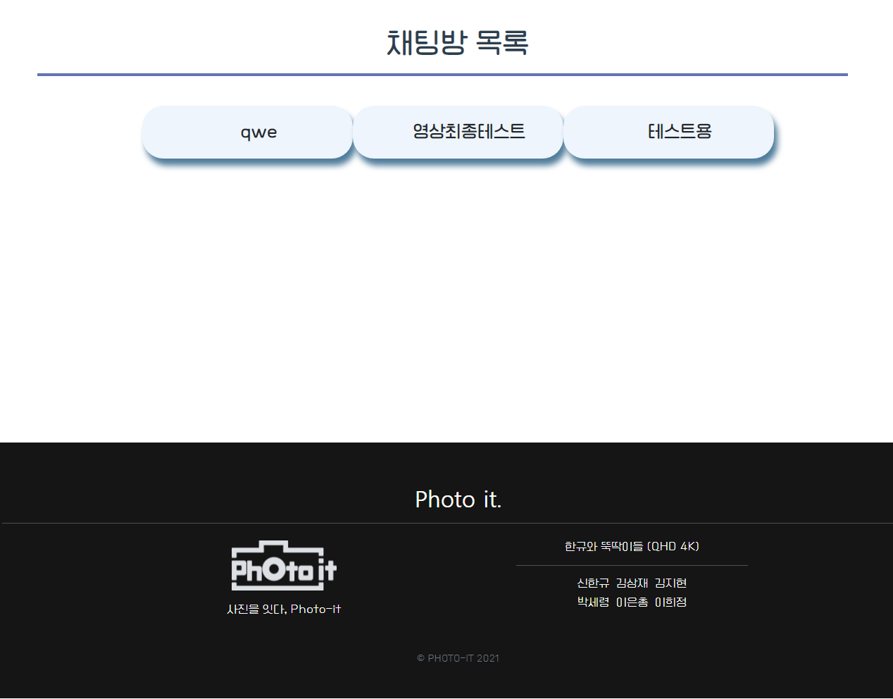

# README.md

# 0. 프로젝트 소개

**Photo-it(포토잇)**은 사진작가와 예비 고객을 이어주는 매칭 플랫폼입니다.

사진 작가는 자신의 사진을 📜포트폴리오처럼 관리할 수 있고, 사진 작가가 필요한 예비 고객들은 업로드된 사진을 보며 마음에 드는 📸사진 작가와 컨택할 수 있습니다.

태그, 작가 닉네임, 작가의 활동 지역에 따른 검색이 가능하며, 마음에 드는 작가를 찜해둘 수도 있습니다.

### 개발 기간

2021.07.05 ~ 2021.08.20

### 와이어 프레임


### ERD


## 1. 실행 방법

- `로컬에서 실행` 하기 위해서는 프론트엔드와 백엔드를 동시에 실행해야 합니다.

  ``` bash
  -- 프론트엔드 실행
  cd frontend/
  npm i
  npm run serv
  
  cd ..
  
  -- 백엔드 실행
  cd backend/
  인텔리제이에서 gradle 실행
  ```

## 2. 개발환경

### 기술 스택

- BackEnd(IntelliJ) : Spring boot, JPA, Redis, MySql, Jenkins, NginX, Docker, AWS
- FrontEnd(NodeJS) : Vue.js


#### Requirements

- IDE : IntelliJ, Visual Code
- module
    - frontend : vue-cli

### 협업툴

- **Jira**

  애자일 협업, 스케쥴 관리

- **Notion**

  문서화, 정보공유, 회의록 정리

  https://www.notion.so/QHD-4K-c81b4789f1b9437e832b2e73b20b22d2

- **Git**

  - 코드 상태 관리
  - 커밋 메세지 컨벤션 사용, 브랜치 네이밍 규칙 사용하여 각자 독립된 브랜치에서 개발

## 3. 기능

### 메인페이지, 디테일 Modal

- 스크롤에 반응하는 인터랙티브 웹 페이지
- 태그별로 최대 20여장의 사진이 캐러셀로 보여집니다.
- 사진을 누르면 모달로 사진을 선택하여 볼 수 있습니다. 
  - 모달에서는 작가의 다른 사진을 확인할 수 있습니다.
  - 작가의 스튜디오로 이동하거나 작가 찜하기, 해제하기도 가능합니다.
  - 사진을 누르면 새로운 탭으로 원본 사진을 볼 수 있습니다.

.gif)


### 회원가입

- 작가 / 일반 회원으로 나뉘어 회원 가입을 할 수 있습니다.
  - 작가: 활동 지역을 추가로 선택할 수 있습니다.
  - 일반 회원으로 가입을 했더라도 마이페이지에서 작가 회원으로 업그레이드할 수 있습니다.


### 로그인

- 로그인 페이지입니다.


### 프로필 아이콘

- 로그인 / 로그아웃 여부에 따라 메뉴가 드롭다운으로 나타납니다.
- 프로필 아이콘은 유저가 회원가입 시 선택한 사진으로 적용되며, 사진을 선택하지 않았을 경우 기본 아이콘이 적용됩니다.


### 마이페이지

- 회원 정보 수정, 회원 탈퇴가 지원되는 페이지입니다.

    - 회원 정보 수정: 닉네임, 비밀번호 변경, 작가회원 전환을 지원합니다.

    

### 마이스튜디오

- 작가가 업로드한 사진을 볼 수 있습니다.
  - 상단바를 통해 작가 찜하기, 해제하기 / 쪽지 보내기 등을 할 수 있습니다.
- 상단 캐러셀에서 작가가 뽑은 자신의 BEST 3 사진을 확인할 수 있습니다.


### 마이 스튜디오 Edit


### 찜 목록

- 찜한 작가들을 모아볼 수 있는 리스트입니다.
- 작가가 자신의 BEST 3 사진을 선정했을 경우 아래 리스트에 BEST 3 사진이 함께 보입니다.


### 검색 결과

- 검색바를 통해 태그, 작가를 검색한 결과를 보여줍니다.

    - 동적 라우팅을 통해 뒤로가기를 하더라도 기존 정보를 계속 볼 수 있습니다.
    - Vue의 라이프 사이클 API를 사용하여 새로고침을 해도 정보가 소실되지 않습니다.

    

    

### 검색바 

- 태그, 작가를 지역별로 검색할 수 있는 검색바 컴포넌트입니다.
- 태그(# 태그이름)의 자동완성이 가능합니다.
  - 서버에서 태그 리스트를 전송해 주면 프론트엔드에서 사용자 입력에 따른 자동완성 기능을 구현합니다.


### 쪽지

- 작가 회원과 일반 회원이 쪽지를 주고 받을 수 있습니다.




## 4. CI / CD

**BACKEND - [README.md](./backend/readme.md)** 

## 5. API

https://docs.google.com/spreadsheets/d/1cMytNr3j-KLNRIuaSeBt3-kl7Mn1lQobTHemsTr9cD0/edit#gid=0

## 5. 역할

- 박세령

  - 팀장
  - Back-End
  - user(회원가입, 로그인) REST api
  - 마이페이지 REST api

- 김상재

  - Front-End (Vue.js, JS, CSS)
  - 회원가입
  - 로고 디자인
  - 마이 스튜디오

- 김지현

  - Back-End
  - 찜 기능 REST api
  - 마이 스튜디오 REST api

- 신한규

  - DB
    - DB 설계
    - ERD, S3 지원 등
  - Full-Stack
  - [Front-End]
    - 쪽지
  - [Back-End]
    - 메인페이지 REST api
    - 검색 결과 REST api

- 이은총

  - Front-End(Vue.js, JS, CSS)
  - 메인페이지
  - 로그인
  - 프로필 아이콘
  - 마이 스튜디오 Edit
  - 찜 목록
  - 검색 결과
  - 검색바
  - 디테일 Modal
  - 기타 CSS 작업

- 이희정

  - DevOps

    -  CI/CD

  - Full-Stack

  - [Front-End]

    - 마이 스튜디오 Edit
    - 마이페이지
    - 메인페이지 Footer

  - [Back-End]

    - 사용자 입력 이미지 데이터 관리(S3)
    - 마이스튜디오 Edit REST api

    
